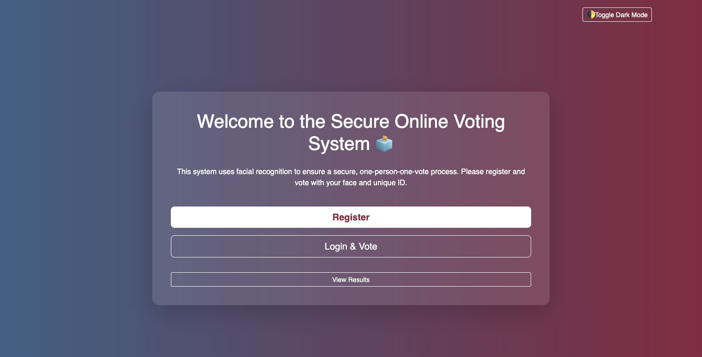
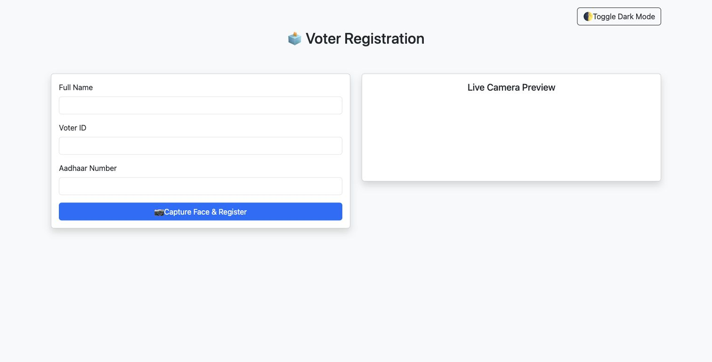
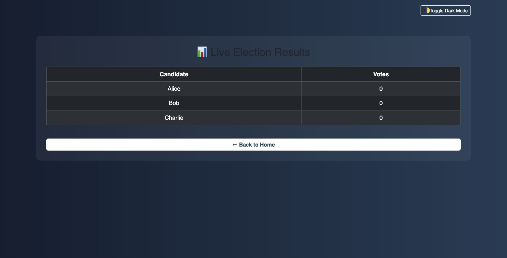

# FaceVote

Facial-recognition based online voting system built with Flask, OpenCV, face recognition, and SQLite.

## Screenshots







## What It Does

- Registers voters through a web interface.
- Captures and verifies voter identity using face recognition.
- Allows authenticated users to vote.
- Stores data using SQLite.
- Shows voting success and result pages through Flask templates.

## Tech Stack

- Python
- Flask
- OpenCV
- face_recognition / dlib
- SQLite
- HTML/CSS

## Structure

```text
app.py
reset_db.py
requirements.txt
templates/
static/
```

## Setup

For full face verification:

```bash
python -m venv .venv
source .venv/bin/activate
pip install -r requirements.txt
python app.py
```

For UI/demo review without compiled face-recognition dependencies:

```bash
python -m venv .venv
source .venv/bin/activate
pip install Flask
python app.py
```

On Windows:

```bash
python -m venv .venv
.venv\Scripts\activate
pip install -r requirements.txt
python app.py
```

Open:

```text
http://127.0.0.1:5000
```

## Notes

- Webcam access and a working `face_recognition`/`dlib` installation are required for the full voting flow.
- The app now starts even when CV packages are missing, so reviewers can inspect the Flask pages, results page, and database-backed candidate setup first.
- Set `FACEVOTE_SECRET_KEY` for any non-demo run.

## Validation

```bash
python -m py_compile app.py reset_db.py
python -c "from app import init_db; init_db(); print('db ok')"
```

## What I Learned

- Building Flask routes and templates.
- Handling local authentication-style workflows.
- Integrating computer vision into a web app.
- Using SQLite for lightweight persistence.
